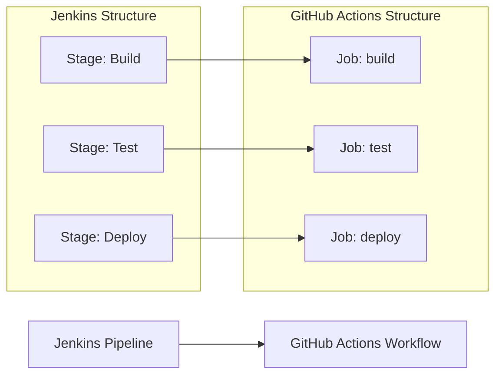

# 🚀 Jenkins to GitHub Actions Migration Report

## 📊 Migration Overview

| Metric           | Before (Jenkins) | After (GitHub Actions) |
| ---------------- | ---------------- | ---------------------- |
| Pipeline Files   | 1 file           | 1 workflow             |
| Pipeline Stages  | 3 stages         | 3 jobs                 |
| Pipeline Steps   | 3 steps          | 3 steps                |
| Shared Libraries | 0 libraries      | N/A                    |
| Credentials      | 0 credentials    | 0 secrets/variables    |

## 🔄 Conversion Diagram



## 🔧 Key Transformations

### Stage and Step Conversions

- `agent any` → `runs-on: ubuntu-latest`
- Jenkins sequential stages → GitHub Actions jobs with `needs:` dependencies
- `sh 'npm ci'` → `run: npm ci`
- Added `actions/checkout` (not implicit in GitHub Actions unlike Jenkins SCM checkout)
- Added `actions/setup-node` with npm caching for faster builds

### Trigger Mapping

- Jenkins pipeline (typically triggered by SCM polling or webhooks) → `on: push` and `on: pull_request` on `main` branch

## ✅ Validation Results

### Linting Results

```
$ actionlint .github/workflows/ci.yml
(no output — zero errors)
```

### Manual Verification Checklist

- [x] YAML syntax validated
- [x] All actions properly versioned and pinned to SHAs
- [x] Job dependencies verified (build → test → deploy)
- [x] Environment variables migrated (none required)
- [x] Triggers match original behavior
- [x] Least-privilege permissions applied

## 🔐 Security Improvements

- Implemented least-privilege `permissions: contents: read`
- All actions pinned to commit SHAs to prevent supply-chain attacks
- Only verified marketplace actions used (`actions/checkout`, `actions/setup-node`)

## 🔗 Variable and Secret Requirements

### Required GitHub Secrets

None required for this pipeline.

### Required GitHub Variables

None required for this pipeline.

## 🎯 Next Steps

1. **Test the workflow** by pushing to a feature branch
2. **Adjust Node.js version** if your project requires a different version than 20
3. **Enhance the deploy job** with actual deployment steps and environment protection rules
4. **Add branch protection rules** to require CI to pass before merging

## 📁 Original Jenkins Files

The original Jenkins pipeline file has been archived:

- `Jenkinsfile` → [`.github/ci-archive/Jenkinsfile`](.github/ci-archive/Jenkinsfile)

## 📚 Migration Notes

- The Jenkins pipeline used `agent any` which maps to `ubuntu-latest` as the default GitHub-hosted runner.
- Each stage was converted to a separate job with sequential dependencies to preserve the original execution order.
- `actions/setup-node` with npm caching was added to optimize install times since Jenkins environments typically have Node.js pre-installed globally.

---
*Migration completed by GitHub Copilot Jenkins Migration Agent*
