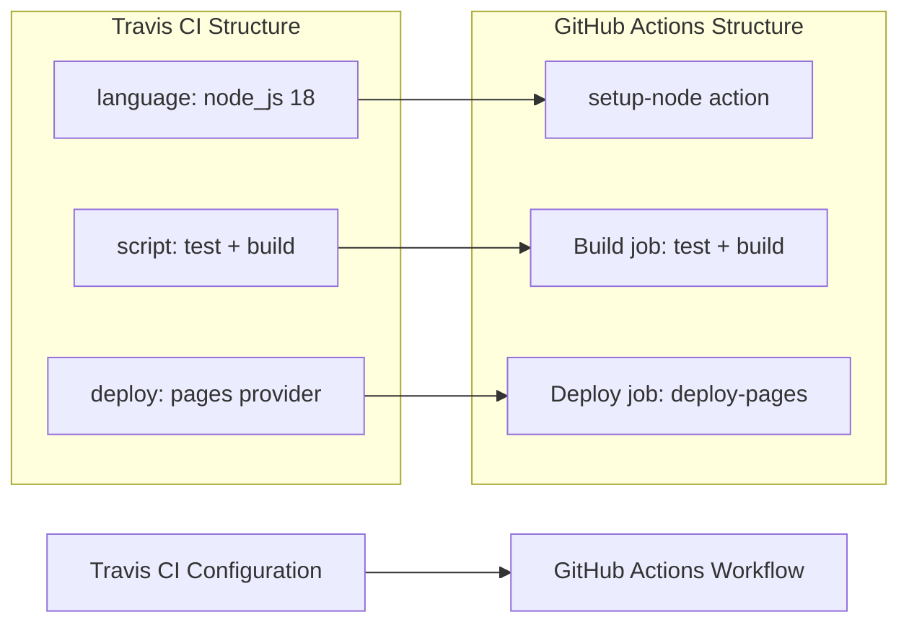

# 🚀 Travis CI to GitHub Actions Migration Report

## 📊 Migration Overview

| Metric               | Before (Travis CI) | After (GitHub Actions) |
| -------------------- | ------------------ | ---------------------- |
| Configuration Files  | 1 file             | 1 workflow             |
| Build Matrix         | 0 dimensions       | 0 matrix strategies    |
| Build Stages         | 1 stage            | 2 jobs                 |
| Service Dependencies | 0 services         | 0 services             |
| Deployment Providers | 1 provider (pages) | 1 deployment job       |
| Encrypted Variables  | 1 (hardcoded!)     | 1 secret (GITHUB_TOKEN)|

## 🔄 Conversion Diagram



## 🔧 Key Transformations

### Build and Test

- `language: node_js` + `node_js: 18` → `actions/setup-node@v4.4.0` with `node-version: '18'`
- `script: npm test / npm run build` → Separate named `run:` steps
- Added `npm ci` for deterministic dependency installation (Travis implicitly ran `npm install`)
- Added npm cache via `actions/setup-node` built-in caching

### Deployment

- Travis CI `deploy.provider: pages` → Official `actions/deploy-pages@v4.0.5` workflow
- Uses the modern GitHub Pages deployment pipeline (`configure-pages` → `upload-pages-artifact` → `deploy-pages`)
- Deployment only triggers on push to `main` (matching Travis default behavior)
- Added environment protection with `github-pages` environment

### Security Fix — Hardcoded Secret Removed

- **CRITICAL**: The original `.travis.yml` contained a hardcoded token: `github_token: "hardcoded-secret-123"`
- This has been replaced with `${{ secrets.GITHUB_TOKEN }}` (built-in, no configuration needed)
- The `GITHUB_TOKEN` is automatically provided by GitHub Actions with the `pages: write` permission

### Structural Changes

- Added `permissions:` block with least-privilege (`contents: read`, `pages: write`, `id-token: write`)
- Added `concurrency:` to prevent concurrent deployments
- Build and deploy are separate jobs with `needs:` dependency

## ✅ Validation Results

### Linting Results

```
$ actionlint .github/workflows/ci.yml
(no output — zero errors)
```

### Manual Verification Checklist

- [x] YAML syntax validated
- [x] All actions pinned to commit SHAs
- [x] Job dependencies verified (`deploy` needs `build`)
- [x] Environment variables migrated (none needed beyond GITHUB_TOKEN)
- [x] Secrets properly referenced (hardcoded token removed)
- [x] Triggers match original behavior (push to main)
- [x] Deployment configured with environment protection

## 🔐 Security Improvements

- Removed hardcoded secret from source control — replaced with built-in `GITHUB_TOKEN`
- Implemented least-privilege `permissions:` block
- All actions pinned to full commit SHAs to prevent supply chain attacks
- Only verified marketplace actions used (all from `actions/*` org)
- Added environment protection for deployments via `github-pages` environment

## 📈 Performance Enhancements

- Added npm dependency caching via `actions/setup-node` built-in cache
- Using `npm ci` instead of implicit `npm install` for faster, deterministic installs
- Concurrent deployment prevention avoids wasted resources

## 🔗 Variable and Secret Requirements

### Required GitHub Secrets

- `GITHUB_TOKEN` — **Automatically provided**, no configuration needed. Used for Pages deployment.

### Required GitHub Variables

- None required.

### Repository Settings Required

- **GitHub Pages** must be configured to deploy from GitHub Actions (Settings → Pages → Source → "GitHub Actions")

## 🎯 Next Steps

1. **Enable GitHub Pages** deployment from Actions in repository Settings → Pages
2. **Test the workflow** by pushing to a feature branch (build will run, deploy will be skipped)
3. **Merge to main** to trigger the first deployment
4. **Rotate/revoke** the hardcoded token `"hardcoded-secret-123"` that was in the original `.travis.yml`
5. **Monitor** the first deployment run for any runtime issues

## 📁 Original Travis CI Files

The original Travis CI configuration file has been moved to `.github/ci-archive/` for reference:

- `.travis.yml` → [`.github/ci-archive/.travis.yml`](.github/ci-archive/.travis.yml)

## 📚 Migration Notes

- The original `.travis.yml` used `skip_cleanup: true` which is a deprecated Travis CI option — not needed in GitHub Actions.
- The `local_dir: build` maps to `path: ./build` in the `upload-pages-artifact` step.
- The hardcoded secret `"hardcoded-secret-123"` was a significant security risk. It has been replaced with the built-in `GITHUB_TOKEN` which requires no manual configuration.

---
*Migration completed by GitHub Copilot Travis CI Migration Agent*
