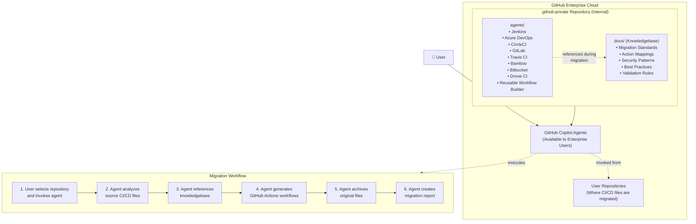
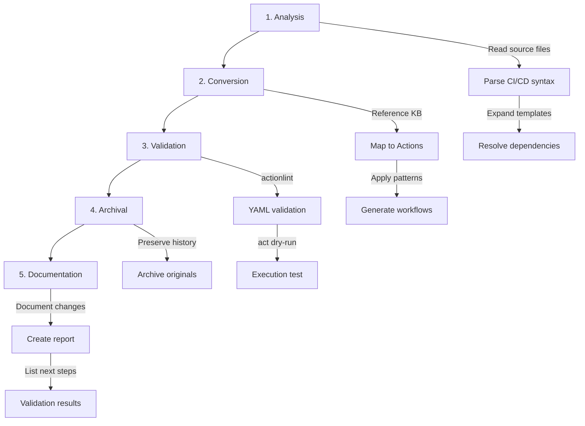

# CI/CD Migration Custom Agents

Enterprise-grade GitHub Custom Agents that automatically migrate CI/CD pipelines from Jenkins, Azure DevOps, CircleCI, GitLab, and other platforms to GitHub Actions—powered by a comprehensive knowledgebase of migration patterns and best practices.

## Why This Project?

### The Challenge

Organizations migrating to GitHub Actions face common obstacles:

- **Inconsistent migrations** across teams and repositories
- **Loss of domain knowledge** during manual conversions
- **Security oversights** when migrating credentials and secrets
- **Time-consuming manual work** translating CI/CD syntax
- **Lack of validation** leading to broken workflows post-migration

### The Solution

**Agent-Powered Migration Benefits:**

- ⚡ **10-100x faster** than manual migration
- 🎯 **Consistent quality** using documented best practices
- 🔒 **Security-first** approach to credential migration
- ✅ **Built-in validation** with actionlint and dry-run testing
- 📊 **Complete documentation** of every migration decision
- 🔄 **Reusable patterns** captured for future migrations

## How It Works

### Architecture



### Migration Process

Each migration follows a standardized five-phase process:



### Knowledgebase-Driven Intelligence

The knowledgebase is the "brain" behind consistent migrations:

| Component               | Purpose                                                            | Example                                                         |
| ----------------------- | ------------------------------------------------------------------ | --------------------------------------------------------------- |
| **Migration Standards** | Define quality requirements, deliverables, and validation criteria | "All workflows must pass actionlint validation"                 |
| **Action Mappings**     | Map CI/CD plugins/tasks to equivalent GitHub Actions               | `maven-plugin` → `actions/setup-java` + Maven commands          |
| **Security Patterns**   | Template secure credential handling                                | Jenkins `withCredentials` → GitHub Secrets with least privilege |
| **Common Patterns**     | Reusable conversion templates                                      | Multi-stage pipeline → Multiple workflow jobs                   |
| **Validation Rules**    | Automated quality checks                                           | Required fields, best practices, security checks                |

Agents dynamically fetch relevant knowledgebase content during migrations, ensuring every conversion benefits from accumulated organizational knowledge.

## What You Get

### Migration Deliverables

Every migration produces:

1. **GitHub Actions Workflows** (`.github/workflows/`)
   - Production-ready, validated YAML
   - Optimized for performance and security
   - Uses latest action versions

2. **Archived Originals** (`.github/ci-archive/`)
   - Complete preservation of source files
   - Organized by CI/CD system
   - Reference for future audits

3. **Migration Report** (`.github/ci-archive/MIGRATION-README.md`)
   - Detailed conversion documentation
   - Validation results (actionlint, act)
   - Next steps and recommendations
   - Knowledgebase references used

4. **Security Enhancements**
   - Proper GitHub Secrets usage
   - Least-privilege permissions
   - Updated action versions
   - Security scanning recommendations

## Available Migration Agents

| Agent                         | Migrates From                      | Handles                                        |
| ----------------------------- | ---------------------------------- | ---------------------------------------------- |
| **Jenkins Migrator**          | Jenkinsfile (declarative/scripted) | Pipelines, shared libraries, Groovy scripts    |
| **Azure DevOps Migrator**     | azure-pipelines.yml                | YAML pipelines, templates, variable groups     |
| **CircleCI Migrator**         | .circleci/config.yml               | Workflows, jobs, Orbs                          |
| **GitLab Migrator**           | .gitlab-ci.yml                     | Pipelines, includes, GitLab Pages              |
| **Travis CI Migrator**        | .travis.yml                        | Build matrix, deploy providers                 |
| **Bamboo Migrator**           | bamboo-specs.yml                   | Build plans, deployment projects               |
| **Bitbucket Migrator**        | bitbucket-pipelines.yml            | Pipelines, Pipes                               |
| **Drone CI Migrator**         | .drone.yml                         | Pipelines, plugins                             |
| **Reusable Workflow Builder** | GitHub Actions across orgs         | Pattern analysis, reusable workflow generation |

### Special Agent: Reusable Workflow Builder

The **Reusable Workflow Builder** is unique—it analyzes CI/CD patterns across your GitHub organization(s) and generates standardized reusable workflows:

```mermaid
graph LR
    subgraph Input["📥 Input: Your GitHub Organizations"]
        O1["Org 1<br/>(50 repos with Actions)"]
        O2["Org 2<br/>(30 repos with Actions)"]
        O3["Org 3<br/>(20 repos with Actions)"]
    end

    subgraph Analysis["🔍 Analysis: Pattern Detection"]
        P1["80% build Node.js apps"]
        P2["60% deploy to AWS"]
        P3["70% use Docker"]
    end

    subgraph Output["📤 Output: Reusable Workflows"]
        R1[".github/workflows/<br/>build-node.yml"]
        R2[".github/workflows/<br/>deploy-aws.yml"]
        R3[".github/workflows/<br/>docker-build-push.yml"]
        R4["docs/<br/>(usage examples)"]
    end

    Input --> Analysis
    Analysis --> Output

    style Input fill:#e1f5ff
    style Analysis fill:#fff4e1
    style Output fill:#e8f5e9
```



This agent reduces duplication, standardizes CI/CD across your enterprise, and captures organizational best practices as reusable workflows.

## Getting Started

### Quick Start

1. **Deploy to your enterprise** following the [Deployment Guide →](docs/deployment.md)
2. **Invoke an agent** from [github.com/copilot/agents](https://github.com/copilot/agents)
3. **Review and test** the migrated workflows
4. **Merge and deploy** your new GitHub Actions workflows

### Documentation

- **[Deployment Guide](docs/deployment.md)** - Complete enterprise setup instructions
- **[Operations Guide](docs/operations.md)** - Day-to-day usage playbooks for each agent
- **[Migration Knowledgebase](knowledge/)** - Standards, patterns, and mappings used by agents

### Example: Jenkins Migration

```
# 1. Create feature branch
git checkout -b migrate/jenkins-to-actions

# 2. Invoke Jenkins Migrator at github.com/copilot/agents
"Please migrate our Jenkins pipeline to GitHub Actions.
Files: Jenkinsfile, vars/buildApp.groovy"

# 3. Agent generates:
.github/
  ├── workflows/
  │   ├── build.yml          # Converted pipeline
  │   └── deploy.yml         # Converted deployment
  └── ci-archive/
      ├── Jenkinsfile        # Original preserved
      ├── vars/
      │   └── buildApp.groovy
      └── MIGRATION-README.md  # Complete report

# 4. Validate
actionlint .github/workflows/*.yml

# 5. Test and merge
git add .github/
git commit -m "Migrate Jenkins to GitHub Actions"
git push
# Create PR, test, and merge
```

## Key Features

### 🧠 Knowledgebase-Driven

Every agent references a comprehensive knowledgebase during migration:
- Migration standards and quality requirements
- CI/CD plugin to GitHub Actions mappings
- Security patterns for credential handling
- Validated conversion templates

**Benefit**: Consistent, high-quality migrations that reflect organizational best practices.

### 🎯 Specialized Agents

Purpose-built agents for each major CI/CD system:
- Deep understanding of source system syntax
- System-specific conversion patterns
- Handles templates, libraries, and shared code
- Inline expansion of external dependencies

**Benefit**: Accurate conversions that preserve original intent and functionality.

### ✅ Automated Validation

Every migration includes validation:
- **actionlint**: YAML syntax and best practices
- **act**: Dry-run workflow execution
- **Security review**: Credential and permission checks
- **Performance**: Optimization recommendations

**Benefit**: Catch issues before deployment, not after.

### 📊 Complete Documentation

Comprehensive migration reports include:
- Every conversion decision documented
- Validation results with actionable fixes
- Security and performance recommendations
- References to knowledgebase patterns used
- Next steps for deployment

**Benefit**: Full audit trail and learning resource for teams.

### 🔒 Security-First

Migrations enhance security posture:
- Proper GitHub Secrets usage
- Least-privilege permissions (GITHUB_TOKEN)
- Updated action versions (latest security patches)
- Security scanning integration recommendations
- Credential rotation guidance

**Benefit**: Migrations improve security, not just translate syntax.

## Project Structure

```
.
├── agents/                    # Agent definition files
│   ├── jenkins-migrator.md
│   ├── azure-devops-migrator.md
│   ├── circleci-migrator.md
│   ├── gitlab-migrator.md
│   ├── travisci-migrator.md
│   ├── bamboo-migrator.md
│   ├── bitbucket-migrator.md
│   ├── droneci-migrator.md
│   └── reusable-workflow-builder.md
│
├── docs/                      # Documentation
│   ├── deployment.md          # Enterprise deployment guide
│   └── operations.md          # Day-to-day operations playbooks
│
├── knowledge/                 # Migration knowledgebase (deploy to .github-private)
│   ├── README.md              # Knowledgebase overview
│   ├── migration-standards.md # Quality and validation standards
│   ├── migration-workflow.md  # Standard 5-phase process
│   ├── migration-guardrails.md # Security and safety guidelines
│   │
│   ├── actions-mapping/       # CI/CD tool → Actions mappings
│   │   ├── jenkins.md
│   │   ├── azure-devops.md
│   │   ├── circleci.md
│   │   ├── gitlab.md
│   │   ├── travisci.md
│   │   ├── bamboo.md
│   │   ├── bitbucket.md
│   │   └── droneci.md
│   │
│   ├── patterns/              # System-specific patterns
│   │   ├── jenkins/
│   │   │   ├── pipeline.md   # Pipeline conversions
│   │   │   ├── groovy.md     # Groovy script handling
│   │   │   └── secrets.md    # Credential migration
│   │   ├── azure-devops/
│   │   │   └── secrets.md
│   │   ├── circleci/
│   │   │   └── secrets.md
│   │   └── ... (other systems)
│   │
│   └── report-template/       # Migration report templates
│       ├── jenkins.md
│       ├── azure-devops.md
│       └── ... (other systems)
│
└── README.md                  # This file (project overview)
```

**Note**: When deploying to your `.github-private` repository, the `knowledge/` folder contents should be deployed as `docs/` (agents reference `.github-private/docs/` during migrations). See the [Deployment Guide](docs/deployment.md) for details.

## Success Stories

### Typical Migration Results

- **Time Savings**: 10-100x faster than manual migration
- **Consistency**: 100% of migrations follow standardized process
- **Quality**: Automated validation catches issues pre-deployment
- **Security**: Enhanced credential management and permissions
- **Documentation**: Complete audit trail of every decision

### Migration Metrics

| Metric              | Before (Manual)  | After (Agent)       | Improvement   |
| ------------------- | ---------------- | ------------------- | ------------- |
| Time per pipeline   | 4-8 hours        | 15-30 minutes       | 10-20x faster |
| Validation coverage | Variable (0-50%) | 100%                | Consistent    |
| Security review     | Manual (hours)   | Automated (seconds) | Built-in      |
| Documentation       | Incomplete       | Complete            | Always        |
| Consistency         | Variable         | Standardized        | Uniform       |

## Support and Resources

- **[Deployment Guide](docs/deployment.md)** - Enterprise setup and configuration
- **[Operations Guide](docs/operations.md)** - Daily usage playbooks
- **[GitHub Actions Documentation](https://docs.github.com/actions)** - Official Actions docs
- **[GitHub Community](https://github.community)** - Community support

## Contributing

Contributions to improve agents and knowledgebase are welcome:

1. **Enhance agents** - Improve conversion accuracy and coverage
2. **Update mappings** - Add new CI/CD tool to Actions mappings
3. **Document patterns** - Share successful migration patterns
4. **Refine standards** - Improve quality and validation criteria
5. **Report issues** - Submit bug reports or feature requests

## License

This project is licensed under the MIT License - see the LICENSE file for details.

## Acknowledgments

Built by GitHub Professional Services for enterprise CI/CD migration programs. Contributions from teams across GitHub's field engineering, solutions architecture, and customer success organizations.

