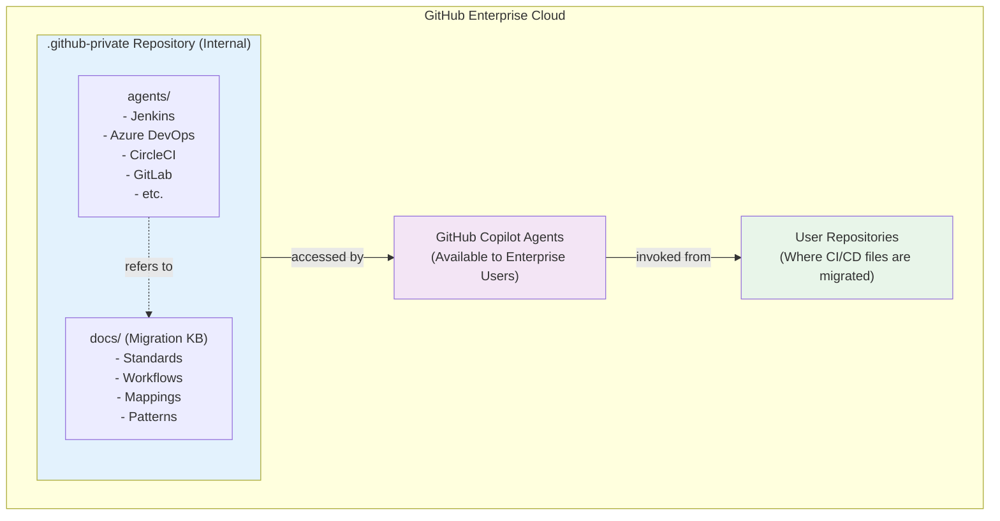

# Deployment Guide

This guide provides step-by-step instructions for deploying CI/CD Migration Custom Agents to your GitHub Enterprise environment.

## Prerequisites

Before beginning deployment, ensure you have:

- **GitHub Enterprise Cloud** with GitHub Copilot Business or Enterprise subscription
- **Enterprise Owner permissions** to configure custom agents
- **Organization Admin permissions** for the target organization
- **Git client** installed on your local machine
- **Access to create repositories** in your enterprise organization

## Architecture Overview



## Deployment Steps

### Step 1: Create the .github-private Repository

The `.github-private` repository serves as the central location for custom agents and the migration knowledgebase.

1. **Navigate to your enterprise organization** on GitHub.com

2. **Create a new repository**:
   - Click **"New repository"**
   - Repository name: **`.github-private`** (exactly as shown, including the leading dot)
   - Visibility: **Internal** (REQUIRED - allows agents to access knowledgebase)
   - Initialize: Do not initialize with README, .gitignore, or license

3. **Verify repository settings**:
   - Confirm visibility is set to **Internal**
   - Note the repository URL for the next steps

> **Why Internal visibility?** Agents use the GitHub MCP (Model Context Protocol) server to access knowledgebase files during migrations. Internal visibility ensures agents can read these files while keeping them private to your enterprise.

### Step 2: Clone and Prepare the Source Repository

1. **Clone this repository** to your local machine:
   ```bash
   git clone https://github.com/github/actions-migrations-via-copilot.git
   cd actions-migrations-via-copilot
   ```

2. **Review the directory structure**:
   ```bash
   tree -L 2
   ```

   You should see:
   ```
   .
   ├── agents/          # Agent definition files
   ├── docs/            # Deployment and operations documentation
   ├── knowledge/       # Migration knowledgebase (deploys as 'docs' in .github-private)
   ├── scratch/         # Temporary files (not deployed)
   └── README.md
   ```

   **Important**: The `knowledge/` folder in this repo becomes the `docs/` folder in your `.github-private` repository. Agents reference `.github-private/docs/` during migrations.

### Step 3: Configure Organization References

Before deploying, update all agent files to reference your organization.

1. **Identify your organization slug**:
   - Your organization slug is visible in URLs: `github.com/{organization-slug}`
   - Example: For `github.com/acme-corp`, the slug is `acme-corp`

2. **Update agent files** with your organization slug:
   ```bash
   # Replace {MY_ORGANIZATION} in all agent files
   find agents -name "*.md" -type f -exec sed -i '' 's/{MY_ORGANIZATION}/YOUR-ORG-SLUG/g' {} +
   ```

   Replace `YOUR-ORG-SLUG` with your actual organization slug.

3. **Verify the changes**:
   ```bash
   grep -r "YOUR-ORG-SLUG" agents/
   ```

   Ensure all references have been updated.

### Step 4: Deploy to .github-private Repository

1. **Add your .github-private repository as a remote**:
   ```bash
   git remote add enterprise https://github.com/YOUR-ORG-SLUG/.github-private.git
   ```

2. **Create a deployment branch**:
   ```bash
   git checkout -b initial-deployment
   ```

3. **Prepare deployment structure**:

   The deployment copies agents and knowledgebase to your `.github-private` repo:
   - `agents/` → `.github-private/agents/`
   - `knowledge/` → `.github-private/docs/` (agents reference this location)

4. **Stage agent and knowledgebase files**:
   ```bash
   # Create docs directory and copy knowledgebase
   mkdir -p .github-private-deploy/agents
   mkdir -p .github-private-deploy/docs

   cp -r agents/* .github-private-deploy/agents/
   cp -r knowledge/* .github-private-deploy/docs/

   cd .github-private-deploy
   git init
   git add agents/ docs/
   git commit -m "Deploy CI/CD migration agents and knowledgebase"
   ```

5. **Push to your .github-private repository**:
   ```bash
   git remote add origin https://github.com/YOUR-ORG-SLUG/.github-private.git
   git push origin main
   ```

   Or if deploying to an existing `.github-private`:
   ```bash
   cd .github-private-deploy
   git remote add origin https://github.com/YOUR-ORG-SLUG/.github-private.git
   git pull origin main --allow-unrelated-histories
   git add agents/ docs/
   git commit -m "Deploy CI/CD migration agents and knowledgebase"
   git push origin main
   ```

6. **Verify deployment** on GitHub:
   - Navigate to `https://github.com/YOUR-ORG-SLUG/.github-private`
   - Confirm directory structure:
     ```
     .github-private/
     ├── agents/
     │   ├── jenkins-migrator.md
     │   ├── azure-devops-migrator.md
     │   └── ... (other agent files)
     └── docs/
         ├── migration-standards.md
         ├── migration-workflow.md
         ├── migration-guardrails.md
         ├── actions-mapping/
         ├── patterns/
         └── report-template/
     ```
   - Check that agent files contain your organization slug (not `{MY_ORGANIZATION}`)

### Step 5: Configure Enterprise Copilot Settings

Enable custom agents for your enterprise organization.

1. **Navigate to Enterprise settings**:
   - Click your profile photo → **Your enterprises**
   - Select your enterprise
   - Click **Settings** → **Copilot** → **AI controls**

2. **Enable custom agents**:
   - Scroll to **"Custom agents"** section
   - Click **"Add organization"**
   - Select the organization containing your `.github-private` repository
   - Click **"Add"**

3. **Verify agent availability**:
   - Navigate to [https://github.com/copilot/agents](https://github.com/copilot/agents)
   - Confirm your migration agents appear in the list:
     - Jenkins to GitHub Actions Migration Agent
     - Azure DevOps Migrator
     - CircleCI Migrator
     - GitLab Migrator
     - Travis CI Migrator
     - Bamboo Migrator
     - Bitbucket Migrator
     - Drone CI Migrator
     - Reusable Workflow Builder

### Step 6: Configure Reusable Workflow Builder (Optional)

The Reusable Workflow Builder agent requires additional setup.

1. **Create a dedicated repository** for reusable workflows:
   ```bash
   # On GitHub.com, create a new repository
   # Name: reusable-workflows (or your preferred name)
   # Visibility: Internal or Private
   ```

2. **Generate a Personal Access Token (PAT)**:
   - Navigate to **Settings** → **Developer settings** → **Personal access tokens** → **Tokens (classic)**
   - Click **"Generate new token (classic)"**
   - Token name: `Copilot Reusable Workflow Scanner`
   - Scopes: Select **`repo`** (full control of private repositories)
   - Expiration: Set according to your organization's policy
   - Click **"Generate token"** and copy the token value

3. **Configure Copilot environment secret**:
   - Navigate to your enterprise settings
   - Go to **Copilot** → **Environment secrets**
   - Click **"New secret"**
   - Name: **`COPILOT_MCP_GITHUB_PERSONAL_ACCESS_TOKEN`** (exactly as shown)
   - Value: Paste your PAT from step 2
   - Click **"Add secret"**

4. **Grant PAT access** to target organizations:
   - For personal PATs: Ensure token has access to organizations you want to scan
   - For organization-owned PATs: Configure appropriate SSO authorization

### Step 7: Verify Deployment

Test that agents can access the knowledgebase.

1. **Create a test repository** with a sample Jenkins file:
   ```bash
   # In a test repository
   mkdir -p test-migration
   cd test-migration
   cat > Jenkinsfile << 'EOF'
   pipeline {
       agent any
       stages {
           stage('Build') {
               steps {
                   sh 'echo "Hello World"'
               }
           }
       }
   }
   EOF
   git add Jenkinsfile
   git commit -m "Add test Jenkins file"
   git push
   ```

2. **Invoke the Jenkins migrator**:
   - Go to [https://github.com/copilot/agents](https://github.com/copilot/agents)
   - Select your test repository and branch
   - Choose **"Jenkins to GitHub Actions Migration Agent"**
   - Enter: `Please migrate the Jenkinsfile to GitHub Actions`
   - Click **"Start task"**

3. **Verify agent behavior**:
   - Agent should access knowledgebase documents from `.github-private/docs/`
   - Agent should generate `.github/workflows/` directory with converted workflow
   - Agent should create `.github/ci-archive/MIGRATION-README.md` with validation results

4. **Check for common issues**:
   - If agent cannot access knowledgebase: Verify `.github-private` has **Internal** visibility
   - If agent not found: Confirm enterprise Copilot settings include your organization
   - If organization references fail: Check that `{MY_ORGANIZATION}` was replaced correctly

## Post-Deployment Configuration

### Update Knowledgebase

As GitHub Actions evolves, update the knowledgebase to reflect new features:

1. **Navigate to your .github-private repository**
2. **Edit knowledgebase files** in `docs/`:
   - `actions-mapping/*.md` - Add new action equivalents
   - `patterns/**/*.md` - Document new migration patterns
   - `migration-standards.md` - Update quality standards

3. **Commit and push changes**:
   ```bash
   git add docs/
   git commit -m "Update knowledgebase with new patterns"
   git push
   ```

Agents automatically reference the latest knowledgebase content on each invocation.

### Maintain Agent Definitions

As new capabilities are needed, update agent definitions:

1. **Edit agent files** in `agents/` directory
2. **Update instructions** to reflect new features or improved patterns
3. **Test changes** by invoking the updated agent
4. **Commit and push** to `.github-private` repository

Changes take effect immediately for all users.

### Monitor Agent Usage

Track agent adoption across your enterprise:

1. **Review agent activity** in Copilot usage reports
2. **Collect feedback** from teams using migration agents
3. **Identify common issues** or enhancement requests
4. **Update knowledgebase** based on real-world migration patterns

## Security Considerations

### Repository Access

- **Internal visibility required**: Agents need read access to knowledgebase
- **Do not make .github-private public**: Contains enterprise-specific guidance
- **Review access logs**: Monitor who can access `.github-private` repository

### PAT Management (Reusable Workflow Builder)

- **Rotate PATs regularly**: Follow your organization's token rotation policy
- **Use least-privilege scope**: Grant only `repo` scope for read access
- **Monitor PAT usage**: Review audit logs for unexpected access patterns
- **Revoke immediately if compromised**: Disable and regenerate if suspicious activity detected

### Secrets in Migrations

- **Review migration reports**: Check how credentials are handled in conversions
- **Validate GitHub Secrets**: Ensure sensitive values are properly stored
- **Update access controls**: Configure environment protection rules for workflows

## Troubleshooting

### Agent Not Appearing in Copilot

**Symptom**: Migration agents don't appear at [github.com/copilot/agents](https://github.com/copilot/agents)

**Solutions**:
1. Verify `.github-private` repository exists in configured organization
2. Check enterprise Copilot settings include the organization
3. Confirm agent `.md` files exist in `agents/` directory
4. Wait 5-10 minutes for agent registration to propagate

### Agent Cannot Access Knowledgebase

**Symptom**: Agent responds with "Cannot access knowledgebase" or similar error

**Solutions**:
1. Verify `.github-private` repository visibility is **Internal** (not Private)
2. Check organization slug in agent files matches your actual organization
3. Confirm `docs/` directory exists in `.github-private` repository
4. Test MCP access manually using GitHub API

### Reusable Workflow Builder Cannot Scan Organizations

**Symptom**: Agent reports "Access denied" or "Cannot list repositories"

**Solutions**:
1. Verify `COPILOT_MCP_GITHUB_PERSONAL_ACCESS_TOKEN` secret exists
2. Check PAT has `repo` scope enabled
3. Ensure PAT has SSO authorization for target organizations
4. Confirm PAT has not expired

### Migration Validation Fails

**Symptom**: Generated workflows contain errors or don't pass validation

**Solutions**:
1. Review `MIGRATION-README.md` for specific validation errors
2. Check that source CI/CD files are valid and complete
3. Update knowledgebase with missing action mappings
4. Test workflows locally using `act` tool

### Organization Slug Mismatch

**Symptom**: Agent references `{MY_ORGANIZATION}` instead of your organization

**Solutions**:
1. Re-run the `sed` command from Step 3 to replace placeholders
2. Manually edit agent files in `.github-private` repository
3. Commit and push updated agent definitions
4. Verify changes by viewing files on GitHub.com

## Next Steps

Once deployment is complete:

1. **Review the [Operations Guide](operations.md)** for instructions on using migration agents
2. **Train your teams** on invoking agents for CI/CD migrations
3. **Establish migration workflows** for systematic pipeline conversions
4. **Monitor and iterate** based on migration results and user feedback

For operational procedures, see [**Operations Guide →**](operations.md)
