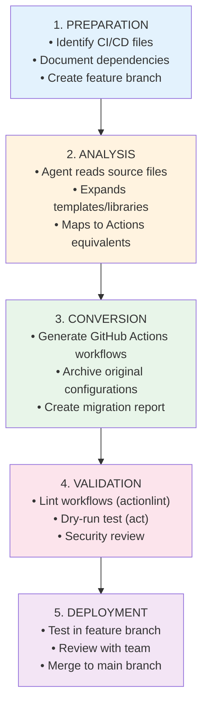

# Operations Guide

This guide provides playbook-style instructions for using CI/CD Migration Custom Agents in your day-to-day operations.

> **📖 New to this project?** Start with the [README](../README.md) for an overview, then follow the [Deployment Guide](deployment.md) to set up agents in your enterprise.

## Latest Features

- **✨ Multi-platform analysis** - Reusable Workflow Builder now analyzes patterns across all CI/CD systems
- **🔒 Enhanced security** - All agents use verified GitHub Actions from trusted publishers
- **✅ Automated validation** - Every migration includes actionlint and dry-run testing
- **📊 Comprehensive reports** - Detailed documentation with knowledgebase references
- **🎯 System-specific agents** - Specialized agents for 8+ CI/CD platforms

## Quick Reference

| Task                           | Agent to Use              | Documentation Section                                            |
| ------------------------------ | ------------------------- | ---------------------------------------------------------------- |
| Migrate Jenkins pipelines      | Jenkins Migrator          | [Jenkins Migration](#jenkins-migration-playbook)                 |
| Migrate Azure DevOps pipelines | Azure DevOps Migrator     | [Azure DevOps Migration](#azure-devops-migration-playbook)       |
| Migrate CircleCI workflows     | CircleCI Migrator         | [CircleCI Migration](#circleci-migration-playbook)               |
| Migrate GitLab CI/CD           | GitLab Migrator           | [GitLab Migration](#gitlab-migration-playbook)                   |
| Migrate Travis CI builds       | Travis CI Migrator        | [Travis CI Migration](#travis-ci-migration-playbook)             |
| Migrate Bamboo plans           | Bamboo Migrator           | [Bamboo Migration](#bamboo-migration-playbook)                   |
| Migrate Bitbucket Pipelines    | Bitbucket Migrator        | [Bitbucket Migration](#bitbucket-migration-playbook)             |
| Migrate Drone CI pipelines     | Drone CI Migrator         | [Drone CI Migration](#drone-ci-migration-playbook)               |
| Generate reusable workflows    | Reusable Workflow Builder | [Reusable Workflow Builder](#reusable-workflow-builder-playbook) |

## General Migration Workflow

All CI/CD migrations follow this standardized process:



## Invoking Migration Agents

### Access the Agents Interface

1. **Navigate to GitHub Copilot agents**:
   ```
   https://github.com/copilot/agents
   ```

2. **Select your repository context**:
   - **Repository**: Choose the repository containing your CI/CD files
   - **Branch**: Select the branch where migration should occur (typically a feature branch)
   - **Agent**: Choose the appropriate migration agent from the dropdown

3. **Compose your migration request**:
   - Clearly describe what you want to migrate
   - List all relevant CI/CD configuration files
   - Mention any special requirements or dependencies

4. **Start the migration task**:
   - Click **"Start task"** or press Enter
   - Monitor agent progress in the conversation

### Best Practices for Agent Invocation

**DO:**
- ✅ Create a feature branch before invoking agents
- ✅ List all CI/CD files that need migration
- ✅ Mention any shared libraries, templates, or includes
- ✅ Specify any custom requirements (specific actions, deployment targets)
- ✅ Review agent output carefully before merging

**DON'T:**
- ❌ Invoke agents directly on main branch
- ❌ Omit important configuration files
- ❌ Skip validation and testing steps
- ❌ Merge without team review
- ❌ Ignore migration reports

## Jenkins Migration Playbook

### Pre-Migration Checklist

- [ ] Identify all Jenkinsfiles (declarative and scripted)
- [ ] Locate shared library files in `vars/` directory
- [ ] Document Jenkins plugins currently in use
- [ ] List credential IDs used in pipelines
- [ ] Note any custom agents or Docker images
- [ ] Create migration feature branch

### Migration Steps

1. **Prepare Repository**:
   ```bash
   git checkout -b migrate/jenkins-to-actions
   git push -u origin migrate/jenkins-to-actions
   ```

2. **Invoke Jenkins Migrator**:
   - Go to [github.com/copilot/agents](https://github.com/copilot/agents)
   - Select your repository and `migrate/jenkins-to-actions` branch
   - Choose **"Jenkins to GitHub Actions Migration Agent"**
   - Provide migration request:
     ```
     Please migrate our Jenkins pipelines to GitHub Actions.

     Files to migrate:
     - Jenkinsfile (declarative pipeline for main build)
     - deploy/Jenkinsfile (deployment pipeline)
     - vars/buildDocker.groovy (shared library)
     - vars/deployApp.groovy (shared library)

     We use the following Jenkins plugins:
     - Docker Pipeline
     - Kubernetes
     - AWS Steps
     ```

3. **Review Agent Output**:
   - Check `.github/workflows/` for generated workflows
   - Review `.github/ci-archive/` for archived Jenkins files
   - Read `.github/ci-archive/MIGRATION-README.md` thoroughly

4. **Validate Workflows**:
   ```bash
   # Install actionlint
   brew install actionlint  # macOS

   # Lint workflows
   actionlint .github/workflows/*.yml
   ```

5. **Test Locally (Optional)**:
   ```bash
   # Install act
   brew install act  # macOS

   # Dry-run workflows
   act -l  # List available jobs
   act push  # Simulate push event
   ```

6. **Configure Secrets**:
   - Navigate to repository **Settings** → **Secrets and variables** → **Actions**
   - Add secrets referenced in migrated workflows
   - Refer to `MIGRATION-README.md` for required secret names

7. **Test in Feature Branch**:
   - Commit changes: `git commit -am "Migrate Jenkins to GitHub Actions"`
   - Push: `git push`
   - Monitor workflow runs in **Actions** tab
   - Verify all jobs complete successfully

8. **Review and Merge**:
   - Create pull request from `migrate/jenkins-to-actions` to `main`
   - Request team review
   - Address any issues or feedback
   - Merge when approved

### Post-Migration

- [ ] Monitor workflow performance over 1-2 weeks
- [ ] Compare build times (Jenkins vs Actions)
- [ ] Update team documentation
- [ ] Decommission Jenkins jobs (if applicable)
- [ ] Archive Jenkins server access (if fully migrated)

## Azure DevOps Migration Playbook

### Pre-Migration Checklist

- [ ] Identify all `azure-pipelines.yml` files
- [ ] Locate template files and their dependencies
- [ ] Document variable groups currently used
- [ ] List service connections (Azure, AWS, etc.)
- [ ] Note any deployment environments
- [ ] Create migration feature branch

### Migration Steps

1. **Prepare Repository**:
   ```bash
   git checkout -b migrate/azdo-to-actions
   git push -u origin migrate/azdo-to-actions
   ```

2. **Invoke Azure DevOps Migrator**:
   - Go to [github.com/copilot/agents](https://github.com/copilot/agents)
   - Select your repository and `migrate/azdo-to-actions` branch
   - Choose **"Azure DevOps to GitHub Actions Migration Agent"**
   - Provide migration request:
     ```
     Please migrate our Azure DevOps pipelines to GitHub Actions.

     Files to migrate:
     - azure-pipelines.yml (main build pipeline)
     - pipelines/deploy-prod.yml (production deployment)
     - templates/build-dotnet.yml (template)
     - templates/deploy-azure.yml (template)

     We use the following Azure services:
     - Azure App Service
     - Azure Container Registry
     - Azure Key Vault
     ```

3. **Review Migration Output**:
   - Check `.github/workflows/` for converted pipelines
   - Verify template expansion inline
   - Review variable mapping in workflows

4. **Configure Azure Authentication**:

   For OIDC (recommended):
   ```bash
   # Create service principal with federated credentials
   az ad sp create-for-rbac --name "GitHub-Actions-OIDC" \
     --role contributor \
     --scopes /subscriptions/{subscription-id}
   ```

   Then configure in GitHub:
   - **Settings** → **Secrets and variables** → **Actions**
   - Add secrets: `AZURE_CLIENT_ID`, `AZURE_TENANT_ID`, `AZURE_SUBSCRIPTION_ID`

5. **Validate and Test**:
   - Lint workflows: `actionlint .github/workflows/*.yml`
   - Test Azure authentication in feature branch
   - Verify deployments to non-production environments

6. **Review and Merge**:
   - Create pull request
   - Test full deployment flow
   - Merge when validated

### Post-Migration

- [ ] Update Azure DevOps project to read-only (if fully migrated)
- [ ] Document new GitHub Actions workflows
- [ ] Train team on Actions-specific features
- [ ] Monitor cost comparison (Azure DevOps vs GitHub Actions)

## CircleCI Migration Playbook

### Pre-Migration Checklist

- [ ] Locate `.circleci/config.yml` file
- [ ] Identify all Orbs used in configuration
- [ ] Document CircleCI context variables
- [ ] Note executor types (Docker, machine, macOS)
- [ ] List workflow dependencies
- [ ] Create migration feature branch

### Migration Steps

1. **Prepare Repository**:
   ```bash
   git checkout -b migrate/circleci-to-actions
   git push -u origin migrate/circleci-to-actions
   ```

2. **Invoke CircleCI Migrator**:
   - Go to [github.com/copilot/agents](https://github.com/copilot/agents)
   - Select your repository and `migrate/circleci-to-actions` branch
   - Choose **"CircleCI to GitHub Actions Migration Agent"**
   - Provide migration request:
     ```
     Please migrate our CircleCI workflows to GitHub Actions.

     Configuration file: .circleci/config.yml

     We use the following Orbs:
     - circleci/node@5.0
     - circleci/docker@2.1
     - circleci/aws-ecr@8.2
     ```

3. **Review Orb Expansions**:
   - Verify Orbs are expanded inline
   - Check that equivalent Actions are used
   - Review workflow job dependencies

4. **Configure Contexts**:
   - Map CircleCI contexts to GitHub Secrets
   - Update secret references in workflows
   - Configure environment-specific secrets

5. **Validate and Test**:
   - Lint workflows
   - Test executor equivalents (Docker vs `runs-on`)
   - Verify caching behavior

6. **Review and Merge**:
   - Create pull request
   - Test all workflow paths
   - Merge when validated

### Post-Migration

- [ ] Pause CircleCI project (if fully migrated)
- [ ] Compare workflow performance metrics
- [ ] Document migration learnings

## GitLab Migration Playbook

### Pre-Migration Checklist

- [ ] Locate `.gitlab-ci.yml` file
- [ ] Identify included template files
- [ ] Document GitLab CI/CD variables
- [ ] Note services and Docker image dependencies
- [ ] List GitLab-specific features (Pages, Container Registry)
- [ ] Create migration feature branch

### Migration Steps

1. **Prepare Repository**:
   ```bash
   git checkout -b migrate/gitlab-to-actions
   git push -u origin migrate/gitlab-to-actions
   ```

2. **Invoke GitLab Migrator**:
   - Go to [github.com/copilot/agents](https://github.com/copilot/agents)
   - Select your repository and `migrate/gitlab-to-actions` branch
   - Choose **"GitLab to GitHub Actions Migration Agent"**
   - Provide migration request:
     ```
     Please migrate our GitLab CI/CD pipelines to GitHub Actions.

     Configuration: .gitlab-ci.yml

     Included templates:
     - .gitlab/ci/build.yml
     - .gitlab/ci/deploy.yml

     We use:
     - GitLab Container Registry
     - GitLab Pages
     - Protected variables
     ```

3. **Review Template Expansion**:
   - Verify `include:` statements are expanded inline
   - Check stage to job mapping
   - Review artifact handling

4. **Migrate GitLab-Specific Features**:

   For GitLab Pages:
   - Convert to GitHub Pages deployment
   - Update workflow to use `actions/deploy-pages@v4`

   For GitLab Container Registry:
   - Switch to GitHub Container Registry (ghcr.io)
   - Update image references in workflows

5. **Validate and Test**:
   - Lint workflows
   - Test artifact uploads/downloads
   - Verify Pages deployment

6. **Review and Merge**:
   - Create pull request
   - Test all stages
   - Merge when validated

### Post-Migration

- [ ] Disable GitLab CI/CD for repository (if fully migrated)
- [ ] Update container image references across services
- [ ] Document new deployment URLs (Pages)

## Travis CI Migration Playbook

### Pre-Migration Checklist

- [ ] Locate `.travis.yml` file
- [ ] Document build matrix configurations
- [ ] Note deploy providers in use
- [ ] List encrypted variables
- [ ] Create migration feature branch

### Migration Steps

1. **Prepare Repository**:
   ```bash
   git checkout -b migrate/travis-to-actions
   git push -u origin migrate/travis-to-actions
   ```

2. **Invoke Travis CI Migrator**:
   - Go to [github.com/copilot/agents](https://github.com/copilot/agents)
   - Select your repository and `migrate/travis-to-actions` branch
   - Choose **"Travis CI to GitHub Actions Migration Agent"**
   - Provide migration request:
     ```
     Please migrate our Travis CI configuration to GitHub Actions.

     Configuration: .travis.yml

     Build matrix includes:
     - Multiple Python versions (3.8, 3.9, 3.10, 3.11)
     - Multiple OS (Linux, macOS)

     Deploy provider: Heroku
     ```

3. **Review Matrix Strategy**:
   - Verify build matrix is converted to `strategy.matrix`
   - Check job naming matches matrix combinations
   - Review parallel execution limits

4. **Migrate Deploy Providers**:
   - Update Heroku deployment to use `akhileshns/heroku-deploy@v3.12`
   - Configure deployment secrets
   - Test deployment workflow

5. **Validate and Test**:
   - Lint workflows
   - Test matrix builds
   - Verify deployment

6. **Review and Merge**:
   - Create pull request
   - Test full matrix
   - Merge when validated

### Post-Migration

- [ ] Deactivate Travis CI for repository (if fully migrated)
- [ ] Compare build times across matrix
- [ ] Update badges in README

## Bamboo Migration Playbook

### Pre-Migration Checklist

- [ ] Export Bamboo build plan as YAML
- [ ] Document Bamboo variables
- [ ] Note task dependencies
- [ ] List deployment projects
- [ ] Create migration feature branch

### Migration Steps

1. **Export Bamboo Configuration**:
   - In Bamboo UI, go to **Plan Configuration** → **Actions** → **Export plan as YAML**
   - Save to repository as `bamboo-specs.yml`

2. **Prepare Repository**:
   ```bash
   git checkout -b migrate/bamboo-to-actions
   git add bamboo-specs.yml
   git commit -m "Add Bamboo configuration export"
   git push -u origin migrate/bamboo-to-actions
   ```

3. **Invoke Bamboo Migrator**:
   - Go to [github.com/copilot/agents](https://github.com/copilot/agents)
   - Select your repository and `migrate/bamboo-to-actions` branch
   - Choose **"Bamboo to GitHub Actions Migration Agent"**
   - Provide migration request:
     ```
     Please migrate our Bamboo build plan to GitHub Actions.

     Configuration: bamboo-specs.yml

     Build stages:
     - Compile
     - Test
     - Package
     - Deploy to staging
     ```

4. **Review and Validate**:
   - Check workflow stages match Bamboo stages
   - Verify task conversions
   - Review deployment configuration

5. **Test and Merge**:
   - Lint workflows
   - Test in feature branch
   - Create PR and merge

### Post-Migration

- [ ] Disable Bamboo plan (if fully migrated)
- [ ] Document workflow differences
- [ ] Update deployment documentation

## Bitbucket Migration Playbook

### Pre-Migration Checklist

- [ ] Locate `bitbucket-pipelines.yml` file
- [ ] Document Bitbucket Pipes in use
- [ ] Note deployment configurations
- [ ] List repository variables
- [ ] Create migration feature branch

### Migration Steps

1. **Prepare Repository**:
   ```bash
   git checkout -b migrate/bitbucket-to-actions
   git push -u origin migrate/bitbucket-to-actions
   ```

2. **Invoke Bitbucket Migrator**:
   - Go to [github.com/copilot/agents](https://github.com/copilot/agents)
   - Select your repository and `migrate/bitbucket-to-actions` branch
   - Choose **"Bitbucket to GitHub Actions Migration Agent"**
   - Provide migration request:
     ```
     Please migrate our Bitbucket Pipelines to GitHub Actions.

     Configuration: bitbucket-pipelines.yml

     We use:
     - Docker Pipes
     - AWS deployment Pipes
     - Custom scripts for testing
     ```

3. **Review Pipe Conversions**:
   - Verify Pipes are mapped to equivalent Actions
   - Check deployment configurations
   - Review branch-specific pipelines

4. **Validate and Test**:
   - Lint workflows
   - Test branch triggers
   - Verify deployments

5. **Review and Merge**:
   - Create pull request
   - Test all pipeline paths
   - Merge when validated

### Post-Migration

- [ ] Disable Bitbucket Pipelines (if fully migrated)
- [ ] Update deployment webhooks
- [ ] Document pipeline differences

## Drone CI Migration Playbook

### Pre-Migration Checklist

- [ ] Locate `.drone.yml` file
- [ ] Document Drone plugins in use
- [ ] Note secrets configuration
- [ ] List pipeline dependencies
- [ ] Create migration feature branch

### Migration Steps

1. **Prepare Repository**:
   ```bash
   git checkout -b migrate/drone-to-actions
   git push -u origin migrate/drone-to-actions
   ```

2. **Invoke Drone CI Migrator**:
   - Go to [github.com/copilot/agents](https://github.com/copilot/agents)
   - Select your repository and `migrate/drone-to-actions` branch
   - Choose **"Drone CI to GitHub Actions Migration Agent"**
   - Provide migration request:
     ```
     Please migrate our Drone CI pipeline to GitHub Actions.

     Configuration: .drone.yml

     Plugins in use:
     - Docker plugin
     - Slack notification plugin
     - AWS S3 upload plugin
     ```

3. **Review Plugin Mappings**:
   - Verify plugins are converted to equivalent Actions
   - Check notification configurations
   - Review pipeline steps

4. **Validate and Test**:
   - Lint workflows
   - Test pipeline execution
   - Verify notifications

5. **Review and Merge**:
   - Create pull request
   - Test complete pipeline
   - Merge when validated

### Post-Migration

- [ ] Deactivate Drone CI for repository (if fully migrated)
- [ ] Update notification channels
- [ ] Document plugin equivalents

## Reusable Workflow Builder Playbook

The Reusable Workflow Builder analyzes CI/CD patterns across your GitHub organizations and generates standardized reusable workflows.

### Pre-Operation Checklist

- [ ] Dedicated repository created for reusable workflows
- [ ] GitHub PAT configured with `repo` scope
- [ ] `COPILOT_MCP_GITHUB_PERSONAL_ACCESS_TOKEN` secret set in Copilot environment
- [ ] Target organizations identified for analysis

### Operation Steps

1. **Prepare Reusable Workflows Repository**:
   ```bash
   # Create or navigate to your reusable workflows repository
   git clone https://github.com/YOUR-ORG/reusable-workflows.git
   cd reusable-workflows

   # Create initial structure
   mkdir -p .github/workflows docs
   git checkout -b generate-reusable-workflows
   git push -u origin generate-reusable-workflows
   ```

2. **Invoke Reusable Workflow Builder**:
   - Go to [github.com/copilot/agents](https://github.com/copilot/agents)
   - Select **reusable-workflows** repository and `generate-reusable-workflows` branch
   - Choose **"Reusable Workflow Builder"**
   - Provide analysis request:
     ```
     Please analyze the following GitHub organizations for CI/CD patterns:
     - acme-corp
     - acme-engineering
     - acme-platform

     Generate reusable workflows for common patterns found across these organizations.

     Focus on:
     - Build and test patterns (Node.js, Python, Go, Java)
     - Docker image builds and pushes
     - Deployment patterns (AWS, Azure, Kubernetes)
     - Security scanning (SAST, dependency scanning)
     ```

3. **Review Generated Workflows**:
   - Check `.github/workflows/` for reusable workflow files
   - Review `docs/` for usage examples
   - Verify workflows follow best practices
   - Check input/output documentation

4. **Test Reusable Workflows**:
   ```bash
   # Create test repository
   git clone https://github.com/YOUR-ORG/test-reusable.git
   cd test-reusable

   # Create workflow that calls reusable workflow
   cat > .github/workflows/test.yml << 'EOF'
   name: Test Reusable Workflow

   on: [push]

   jobs:
     call-reusable:
       uses: YOUR-ORG/reusable-workflows/.github/workflows/build-node.yml@main
       with:
         node-version: '18'
   EOF

   git add .github/workflows/test.yml
   git commit -m "Test reusable workflow"
   git push
   ```

5. **Validate and Merge**:
   - Verify test workflows execute successfully
   - Review generated documentation
   - Create pull request in reusable-workflows repository
   - Merge when validated

6. **Distribute to Teams**:
   - Announce new reusable workflows to organization
   - Provide usage examples from `docs/`
   - Create internal documentation linking to workflows
   - Train teams on calling reusable workflows

### Post-Operation

- [ ] Monitor adoption of reusable workflows across repositories
- [ ] Collect feedback from teams
- [ ] Iterate on workflow designs based on usage patterns
- [ ] Update workflows as Actions ecosystem evolves
- [ ] Re-run analysis periodically to find new patterns

## Maintenance and Monitoring

### Updating the Knowledgebase

As GitHub Actions evolves, keep the knowledgebase current:

1. **Monitor GitHub Actions updates**:
   - Subscribe to [GitHub Changelog](https://github.blog/changelog/)
   - Watch for new actions and features
   - Track deprecations and breaking changes

2. **Update action mappings**:
   ```bash
   # Navigate to .github-private repository
   cd .github-private

   # Edit mapping files
   vim docs/actions-mapping/jenkins.md  # Add new plugin mappings

   # Commit and push
   git add docs/actions-mapping/
   git commit -m "Update Jenkins plugin mappings"
   git push
   ```

3. **Document new patterns**:
   - Add successful migration patterns to `docs/patterns/`
   - Update best practices based on real-world migrations
   - Share learnings across teams

### Monitoring Migration Success

Track migration outcomes to improve process:

1. **Collect metrics**:
   - Migration completion rate
   - Workflow execution success rate
   - Build time comparisons (before/after)
   - Cost comparisons (old CI vs GitHub Actions)

2. **Gather feedback**:
   - Survey teams after migrations
   - Document common issues and solutions
   - Identify knowledgebase gaps

3. **Iterate on process**:
   - Update operations playbooks
   - Refine agent instructions
   - Improve validation steps

### Troubleshooting Common Issues

#### Workflow Fails After Migration

**Symptoms**: Migrated workflow fails in GitHub Actions

**Diagnosis Steps**:
1. Review workflow run logs in GitHub Actions UI
2. Check migration report (`.github/ci-archive/MIGRATION-README.md`)
3. Compare original CI/CD file with generated workflow
4. Verify all secrets are configured

**Common Fixes**:
- Add missing secrets to repository settings
- Update action versions to latest
- Fix YAML syntax errors flagged by actionlint
- Adjust runner labels (`runs-on`) for environment requirements

#### Agent Cannot Access Source Files

**Symptoms**: Agent reports "Cannot find file" or "Access denied"

**Diagnosis Steps**:
1. Verify files exist in selected branch
2. Check file paths are correct (case-sensitive)
3. Confirm repository permissions

**Common Fixes**:
- Push files to branch before invoking agent
- Use correct file paths in migration request
- Verify agent has repository access

#### Migration Report Missing Validation Results

**Symptoms**: `MIGRATION-README.md` lacks actionlint or act output

**Diagnosis Steps**:
1. Check if validation tools ran successfully
2. Review agent conversation for errors
3. Verify local testing requirements

**Common Fixes**:
- Re-run migration with explicit validation request
- Install actionlint/act locally and validate manually
- Update agent instructions to require validation

## Best Practices Summary

### Before Migration

- ✅ **Create feature branch** for migration work
- ✅ **Document current state** of CI/CD configuration
- ✅ **List all dependencies** (credentials, services, tools)
- ✅ **Backup configurations** outside repository

### During Migration

- ✅ **Review agent output thoroughly** before committing
- ✅ **Read migration reports** for warnings and recommendations
- ✅ **Test in feature branch first** before merging
- ✅ **Validate with actionlint and act** when possible

### After Migration

- ✅ **Monitor workflow runs** for 1-2 weeks
- ✅ **Compare performance metrics** with old CI system
- ✅ **Update team documentation** to reflect new workflows
- ✅ **Decommission old CI** only when fully validated
- ✅ **Share learnings** with other teams

## Getting Help

### Resources

- **Migration Reports**: Always start with `.github/ci-archive/MIGRATION-README.md`
- **Knowledgebase**: Review `.github-private/docs/` for migration standards
- **GitHub Actions Docs**: [docs.github.com/actions](https://docs.github.com/actions)
- **Community Forums**: [github.community](https://github.community)

### Support Channels

1. **Internal Team**: Consult with teams who have completed migrations
2. **GitHub Support**: Contact your Enterprise support team
3. **Agent Updates**: Submit feedback to improve agent capabilities

### Feedback Loop

Help improve migration agents:

1. **Document issues** encountered during migrations
2. **Share successful patterns** that could be added to knowledgebase
3. **Suggest agent improvements** based on experience
4. **Contribute to knowledgebase** with new mappings and patterns

## Next Steps

- **Start with pilot migrations**: Choose 2-3 simple pipelines to test the process
- **Iterate and improve**: Refine your migration playbook based on results
- **Scale across organization**: Apply learnings to larger migration efforts
- **Maintain and evolve**: Keep knowledgebase updated as Actions ecosystem grows

For deployment and setup instructions, see [**Deployment Guide →**](deployment.md)
