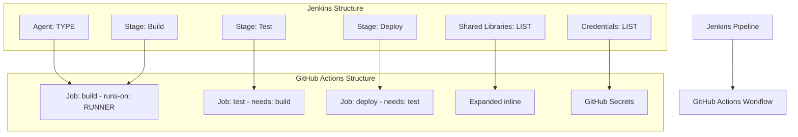

# Jenkins to GitHub Actions Migration Report Template

Use this template when creating `.github/ci-archive/MIGRATION-README.md` after completing a Jenkins to GitHub Actions migration.

---

# 🚀 Jenkins to GitHub Actions Migration Report

## 📊 Migration Overview

| Metric              | Before (Jenkins)            | After (GitHub Actions) |
| ------------------- | --------------------------- | ---------------------- |
| Pipeline Files      | [X] files                   | [Y] workflows          |
| Pipeline Type       | [Declarative/Scripted/YAML] | GitHub Actions YAML    |
| Pipeline Stages     | [X] stages                  | [Y] jobs               |
| Pipeline Steps      | [X] steps                   | [Y] steps              |
| Shared Libraries    | [X] libraries               | Expanded inline        |
| Credential Bindings | [X] credentials             | [Y] secrets/variables  |
| Agents/Nodes        | [X] agents                  | [Y] runners            |
| Parallel Stages     | [X] parallel                | [Y] concurrent jobs    |

## 🔄 Conversion Diagram



## 🔧 Key Transformations

### Pipeline Type Conversions
[Document which Jenkins pipeline type was migrated]
- **Source**: [Declarative/Scripted/YAML] Pipeline
- **Target**: GitHub Actions workflow
- **Structure Changes**: [Describe major structural changes]

### Stage to Job Mappings
[List each Jenkins stage and its corresponding GitHub Actions job]

| Jenkins Stage | GitHub Actions Job | Dependencies | Notes       |
| ------------- | ------------------ | ------------ | ----------- |
| [Stage 1]     | [job-1]            | None         | [Any notes] |
| [Stage 2]     | [job-2]            | job-1        | [Any notes] |
| [Stage 3]     | [job-3]            | job-2        | [Any notes] |

### Shared Library Expansions
[Document all shared library calls that were expanded]

| Library Function | Expanded To                          | Notes     |
| ---------------- | ------------------------------------ | --------- |
| [function1]      | [marketplace action or shell script] | [Details] |
| [function2]      | [marketplace action or shell script] | [Details] |

### Agent to Runner Mappings
[Document Jenkins agent to GitHub runner mappings]

| Jenkins Agent | GitHub Runner    | Container        | Notes   |
| ------------- | ---------------- | ---------------- | ------- |
| [agent 1]     | [ubuntu-latest]  | [None/image:tag] | [Notes] |
| [agent 2]     | [windows-latest] | [None/image:tag] | [Notes] |

### Step and Tool Mappings
[Document specific Jenkins steps and their GitHub Actions equivalents]

| Jenkins Step       | GitHub Actions            | Action Version | Notes             |
| ------------------ | ------------------------- | -------------- | ----------------- |
| `checkout scm`     | `actions/checkout`        | v4             | Standard checkout |
| `archiveArtifacts` | `actions/upload-artifact` | v4             | Artifact storage  |
| `junit`            | `dorny/test-reporter`     | v1             | Test reporting    |
| [Custom step]      | [Action/script]           | [Version]      | [Details]         |

### Credential and Environment Mappings
[Document all credential conversions]

| Jenkins Credential | Type              | GitHub Secret/Variable | Scope        | Notes     |
| ------------------ | ----------------- | ---------------------- | ------------ | --------- |
| [cred-id-1]        | String            | `SECRET_NAME`          | Repository   | [Details] |
| [cred-id-2]        | Username/Password | `USER` + `PASS`        | Organization | [Details] |
| [cred-id-3]        | SSH Key           | `SSH_PRIVATE_KEY`      | Environment  | [Details] |
| [cred-id-4]        | File              | `CONFIG_FILE`          | Repository   | [Details] |

### Jenkins Environment Variables to GitHub Context
[Document environment variable mappings]

| Jenkins Variable | GitHub Actions             | Notes        |
| ---------------- | -------------------------- | ------------ |
| `BUILD_NUMBER`   | `${{ github.run_number }}` | Build number |
| `GIT_COMMIT`     | `${{ github.sha }}`        | Commit SHA   |
| `BRANCH_NAME`    | `${{ github.ref_name }}`   | Branch name  |
| [Custom var]     | `${{ vars.CUSTOM_VAR }}`   | [Details]    |

### Conditional Logic Conversions
[Document when conditions and if statements]

| Jenkins When/Condition   | GitHub Actions If                     | Notes       |
| ------------------------ | ------------------------------------- | ----------- |
| `when { branch 'main' }` | `if: github.ref == 'refs/heads/main'` | Main branch |
| [Other condition]        | [If expression]                       | [Details]   |

### Parallel Execution Changes
[Document parallel stage conversions]

| Jenkins Parallel Block | GitHub Actions Jobs   | Notes              |
| ---------------------- | --------------------- | ------------------ |
| [Parallel stage group] | [job-1, job-2, job-3] | [Run concurrently] |

### Plugin Replacements
[Document Jenkins plugins and their GitHub Actions alternatives]

| Jenkins Plugin | GitHub Actions Alternative | Version   | Notes     |
| -------------- | -------------------------- | --------- | --------- |
| [Plugin 1]     | [Action or method]         | [Version] | [Details] |
| [Plugin 2]     | [Action or method]         | [Version] | [Details] |

## ✅ Validation Results

### Linting Results
```
[INSERT ACTUAL ACTIONLINT OUTPUT HERE]
```

### Act Dry-Run Results
```
[INSERT ACTUAL ACT DRYRUN OUTPUT HERE]
```

### Manual Verification Checklist
- [x] YAML syntax validated
- [x] All actions properly versioned with latest stable versions
- [x] Job dependencies verified
- [x] Environment variables migrated
- [x] Secrets properly referenced
- [x] Jenkins agents converted to appropriate runners
- [x] Jenkins credentials converted to GitHub Actions secrets
- [x] Jenkins shared libraries expanded inline
- [x] Jenkins parallel stages converted to concurrent jobs
- [x] Jenkins when conditions converted to GitHub Actions if statements
- [x] Plugin replacements verified
- [x] Conditional execution working correctly
- [x] Post-build actions converted
- [x] Triggers match original behavior
- [x] Act dryrun completed successfully

## 🔐 Security Improvements

[Document security enhancements during migration]

- Migrated [X] Jenkins credentials to GitHub Secrets with proper scoping
- Implemented least-privilege permissions with `permissions:` blocks
- Configured environment protection rules for [list environments]
- Enhanced secret management with organization-level secrets for shared credentials
- Separated sensitive credentials from non-sensitive configuration
- Implemented credential rotation schedule
- [Other security improvements]

## 📈 Performance Enhancements

[Document performance improvements]

- Added intelligent caching for [dependencies/tools]
- Optimized job parallelization: [X] stages now run concurrently
- Reduced build time by approximately [X]% through [improvements]
- Implemented artifact sharing between jobs
- Enhanced deployment speed with [improvements]
- [Other performance enhancements]

## 🔗 Variable and Secret Requirements

### Required GitHub Secrets

[List ALL secrets that must be configured in GitHub]

#### Organization-Level Secrets (Shared)
- `SECRET_NAME` - [Description] (formerly Jenkins credential: [id])
- `SECRET_NAME` - [Description] (formerly Jenkins credential: [id])

#### Repository-Level Secrets
- `SECRET_NAME` - [Description] (formerly Jenkins credential: [id])
- `SECRET_NAME` - [Description] (formerly Jenkins credential: [id])

#### Environment-Specific Secrets

**Development Environment:**
- `SECRET_NAME` - [Description]

**Staging Environment:**
- `SECRET_NAME` - [Description]

**Production Environment:**
- `SECRET_NAME` - [Description]

### Required GitHub Variables

[List ALL variables that should be configured]

#### Organization-Level Variables
- `VARIABLE_NAME` - [Description] (formerly Jenkins env: [name])

#### Repository-Level Variables
- `VARIABLE_NAME` - [Description] (formerly Jenkins env: [name])

## 🎯 Next Steps

[Provide specific next steps for this migration]

1. **Configure secrets and variables** in GitHub repository settings:
   - Navigate to Settings → Secrets and variables → Actions
   - Add all required secrets listed above
   - Configure organization-level secrets if applicable

2. **Set up environments** with protection rules:
   - Create environments: [list]
   - Configure required reviewers for production deployments
   - Set deployment branch restrictions

3. **Configure branch protection rules**:
   - Require status checks from workflows
   - [Other specific rules]

4. **Test the workflows**:
   - Push to feature branch first
   - Verify all jobs execute successfully
   - Check artifact uploads/downloads
   - Validate secret access

5. **Monitor initial executions**:
   - Review workflow run logs
   - Check for any runtime issues
   - Validate deployments work correctly

6. **Update team documentation**:
   - Document new workflow process
   - Update deployment procedures
   - Share secret rotation schedule

7. **Train team members**:
   - Conduct walkthrough of new workflows
   - Explain GitHub Actions features
   - Review approval process for deployments

8. **Decommission Jenkins**:
   - Archive Jenkins server configuration
   - Document any remaining Jenkins-specific processes
   - Plan Jenkins server shutdown timeline

## 📁 Original Jenkins Files

The original Jenkins pipeline files have been moved to `.github/ci-archive/` for reference:

- `Jenkinsfile` → [`.github/ci-archive/Jenkinsfile`](.github/ci-archive/Jenkinsfile)
- [Other files] → [`.github/ci-archive/[path]`](.github/ci-archive/[path])

### Shared Library Files (if applicable)
- `vars/` directory → [`.github/ci-archive/vars/`](.github/ci-archive/vars/)
- [Specific library files]

## 📚 Migration Notes

[Include any specific notes about this migration]

### Decisions Made
- [Decision 1 and rationale]
- [Decision 2 and rationale]

### Shared Library Expansions
- [Library 1]: [How it was expanded]
- [Library 2]: [How it was expanded]

### Plugin Replacements
- [Plugin 1]: [Why specific replacement was chosen]
- [Plugin 2]: [Why specific replacement was chosen]

### Groovy Script Conversions
- [Script 1]: [How Groovy logic was converted]
- [Script 2]: [How Groovy logic was converted]

### Challenges Encountered
- [Challenge 1]: [How it was resolved]
- [Challenge 2]: [How it was resolved]

### Potential Issues to Watch
- [Issue 1]: [Why and what to monitor]
- [Issue 2]: [Why and what to monitor]

### Special Considerations
- [Consideration 1]
- [Consideration 2]

## 📞 Support and Resources

### GitHub Actions Documentation
- [Workflow syntax](https://docs.github.com/en/actions/using-workflows/workflow-syntax-for-github-actions)
- [Contexts](https://docs.github.com/en/actions/learn-github-actions/contexts)
- [Expressions](https://docs.github.com/en/actions/learn-github-actions/expressions)

### Marketplace Actions Used
- [Action 1]: [Link to marketplace]
- [Action 2]: [Link to marketplace]

### Contact
For questions about this migration, contact: [Team/Person]

---

**Migration completed on:** [DATE]
**Migration completed by:** GitHub Copilot Jenkins Migration Agent
**Migration duration:** [X] hours/days
**Validated by:** [Name/Team]
